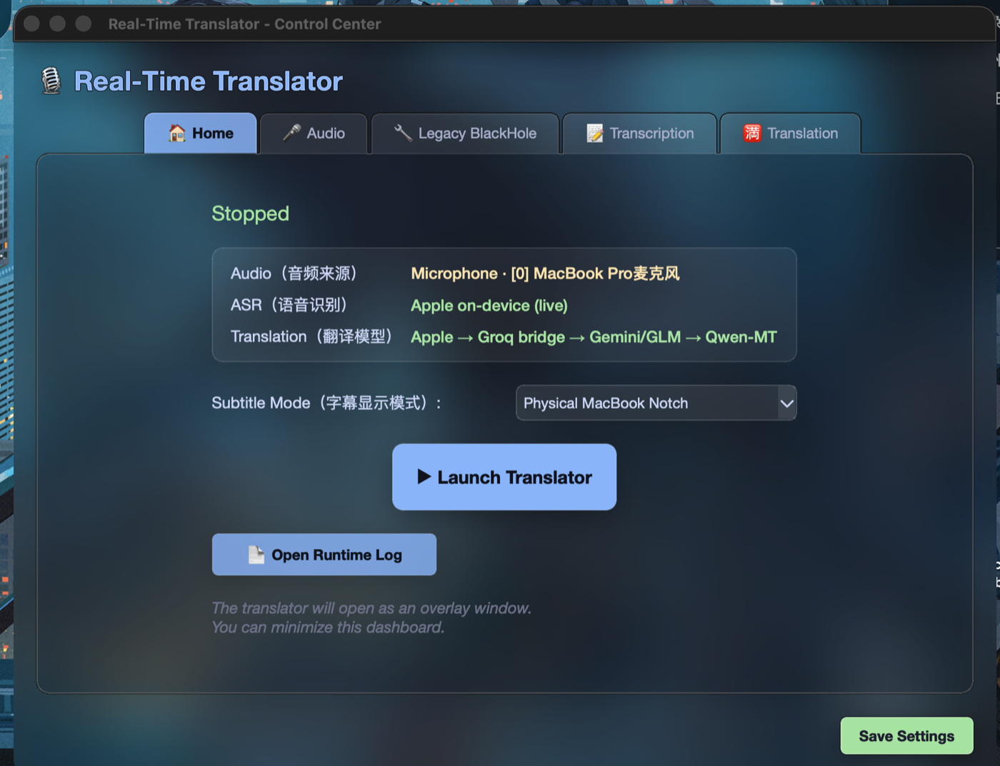
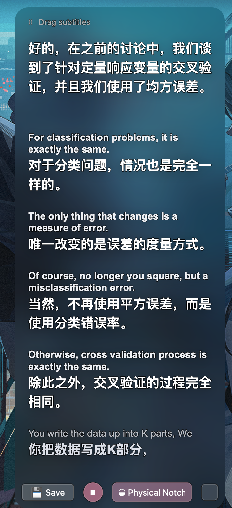

# Anotime

<p align="center">
  <a href="#中文说明">中文</a> · <a href="#english">English</a>
</p>

<a id="中文说明"></a>

## 中文说明

<p align="center"><strong>这款应用帮助大家度过一开始的语言难关，避免大家像 Ano 一样过了雅思却听不懂课（早知道不如去花咲川）。</strong></p>

**面向 macOS 课堂、会议和全屏视频的速度优先型英译中实时字幕工具：先显示 Apple 本地草稿，再由可选 AI 持续修正。**

Anotime 使用 Apple 端侧语音识别与即时翻译提供低延迟草稿。普通用户只需配置一个常见模型或任意 OpenAI-compatible 接口；模型支持时，会在老师尚未说完时持续补出临时译文，再更新最终稿。远程模型变慢或失败时，Apple 草稿仍会保留。

应用可通过 ScreenCaptureKit 直接监听 Mac 本机音频，无需配置 BlackHole；字幕可以显示为可调整大小的磨砂玻璃窗口，也可以贴合 MacBook 物理刘海显示。

> 主要面向 Apple Silicon MacBook。通用 Python/Qt 路径可以在其他平台运行，但 Apple Speech、Apple Translation、ScreenCaptureKit 系统音频和物理刘海界面仅支持 macOS。

### 与原始 realtime-subtitle 的区别

Anotime 已经不只是原项目的界面换皮，而是围绕 macOS 课堂使用重新组织了实时链路：

- 使用 Apple 原生流式 ASR、Apple Translation 快速草稿和独立远程定稿路径，网络请求不会阻塞本地字幕。
- 使用 ScreenCaptureKit 直接捕获网页、播放器和会议软件的系统音频，不再把 BlackHole 作为默认方案。
- 增加贴合 MacBook 物理刘海的原生字幕，以及可在全屏视频上置顶、任意边缘缩放的玻璃字幕。
- 将翻译拆为通用 Single Model、完全本地 Apple Only，以及维护者专用 Smart Hybrid；三条流程彼此隔离。
- Single Model 支持常见 OpenAI-compatible 服务、自定义 Base URL/模型、流式兼容降级、五次测速和按服务保存的本地 Profile。
- API Key 进入 macOS Keychain；服务档案和配置文件只保存 Keychain 引用。
- 增加 stable/finalized 字幕状态、分阶段上下文预算、latest-wins、硬截止时间、长句显示切分、后台课堂记录与延迟诊断。

### 界面预览

#### 控制中心



#### 物理刘海字幕


#### 可调整大小的玻璃字幕

<p align="center">
  
</p>

### 主要功能

- Apple Speech 实时识别，并用透明度区分临时英文与 finalized 英文。
- 通过 ScreenCaptureKit 直接翻译浏览器视频、网课、Zoom 和其他应用音频。
- Apple 草稿走独立快速路径，远程模型限时执行，不阻塞后续字幕。
- 三种独立流程：普通用户优先使用通用 Single Model，也可选择完全本地 Apple Only；Smart Hybrid 仅供维护者的固定 API 池使用，修改 Single Model 不会改变它。
- Single Model 的 Key、URL、模型、课程主题、目标语言、实时返回、桥接、价格和测速均由控制中心统一配置；`Auto` 会在服务不支持流式返回时自动退回完整译文。
- 内置 API 测速：发送五条固定技术语句，显示首字延迟和平均单次总耗时。
- 物理刘海支持显示 1/2/3 条消息、自动宽度、长译文切段、暂停、玻璃模式和退出菜单。
- 磨砂玻璃字幕可以从任意边缘或角落调整大小，并保持在全屏视频上方。
- 支持可选 TSV 术语表和 finalized ASR 纠错表；新用户默认不会加载维护者的课程术语。
- Single Model 支持 Qwen-MT、DeepSeek、SiliconFlow、OpenAI、Gemini、Groq、OpenRouter 和自定义 OpenAI-compatible 接口。
- 每个 Single Model 服务可独立保存 Key、Base URL、当前模型和自定义模型列表，切换后自动恢复。
- 开发者 Smart Hybrid 使用 Groq → Cerebras 桥接轮换、免费 GLM 额度管理与 Gemini 3.5 Flash-Lite 付费主翻译；Qwen-MT 仅保留为可选 Single Model。
- `Control + S` 全局快捷键可启动、暂停和恢复刘海翻译，无需辅助功能或输入监控权限。

#### 可用的免费模型

- Apple Speech + Apple Translation：[macOS 26+ 内置](https://support.apple.com/)；首次使用可能需要后台准备中英文语言资源。
- GPT-OSS 20B：[Groq Console](https://console.groq.com/)。
- GPT-OSS 120B：[Cerebras Inference](https://cloud.cerebras.ai/)。
- Gemini 3.5 Flash-Lite：[Google AI Studio](https://aistudio.google.com/)。
- GLM-4.7-Flash：[Cloudflare Dashboard](https://dash.cloudflare.com/)。
- Qwen-MT Flash：[阿里云百炼](https://bailian.console.aliyun.com/)。

免费额度和模型可用性可能变化，正式上课前应在对应平台确认。

### 环境要求

- 推荐 Apple Silicon Mac。
- 原生 Apple `SpeechAnalyzer`、`SpeechTranscriber` 和本地 Apple Translation 要求 macOS 26 或更高版本。
- Python 3.10+。
- Xcode Command Line Tools。
- Homebrew 和 FFmpeg。

Apple Speech/Translation 不可用时可以选择 Whisper/MLX 与远程翻译。首次准备 Apple Translation 语言资源期间，Pipeline 会继续运行，并在控制中心显示准备状态。Windows 保留旧启动脚本，但当前低延迟原生功能主要面向 macOS。

### 安装

> **受邀体验者**：请先阅读 [macOS 受邀体验指南](./docs/BETA_TESTER_GUIDE.md)。当前公开仓库仍是开发者安装路径；不要向任何人索取或填写维护者的共享模型 API Key。

```bash
git clone https://github.com/Nyarlathoteppppp/ano-time.git
cd ano-time
chmod +x install_mac.sh start_mac.sh
./install_mac.sh
```

缺少 FFmpeg 时：

```bash
brew install ffmpeg
```

安装脚本会创建项目内的 `.venv-pyside`、安装 Python 依赖、构建 Apple Speech 与原生刘海 helper，并从示例生成 `config.ini`。

#### 安装桌面应用和快捷键

```bash
chmod +x install_desktop_app.sh install_hotkey_agent.sh
./install_desktop_app.sh
./install_hotkey_agent.sh
```

完成后可以像普通 Mac 应用一样打开 **Anotime.app**。应用采用单实例机制，重复打开只会激活已有控制中心，不会产生多个翻译窗口。

`Control + S` 在停止状态下启动物理刘海翻译，在运行时暂停，在暂停时恢复。快捷键由常驻 LaunchAgent 注册，不需要辅助功能或输入监控权限。

普通 Python 源码更新不需要重新安装桌面应用。只有首次安装或 launcher 本身发生变化时才运行 `install_desktop_app.sh`；重新签名可能导致 macOS 再次要求隐私权限。

### 快速开始

```bash
./start_mac.sh
```

在控制中心中：

1. **Audio**：翻译视频或应用时选择 `System Audio`，线下课堂选择麦克风。
2. **ASR · 语音识别**：默认选择 `Apple`；可实验 `Parakeet EOU`（英文首字更快、资源更高），Apple Silicon Whisper 路径选择 `MLX`。
3. **AI · 翻译**：选择翻译流程、可选桥接模型，并填写对应 API Key。
4. **Subtitle Mode**：选择 `Physical MacBook Notch` 或 `Glass`。
5. 点击 **Launch Translator**。

API Key 会保存在 macOS Keychain。被 Git 忽略的 `config.ini` 只保存 `keychain://...` 引用；旧的明文密钥会在成功写入 Keychain 后自动迁移。不要把真实密钥放进 Issue、日志、截图或 README；已经公开的密钥应立即轮换。

### 发布前安全检查

在创建 GitHub Release、DMG 或发送体验包前运行：

```bash
python3 tools/release_audit.py .
```

该检查只扫描 Git 已跟踪的文本文件，不读取 Keychain 或本机 `config.ini`；若发现 Key 形态文本或私人配置/记录被加入版本库，会失败且不会打印密钥值。完整产品与 App Store 路线见 [发布路线文档](./docs/PRODUCT_RELEASE_AND_APP_STORE_ROADMAP.md)。

### macOS 权限

#### 翻译浏览器或应用音频

打开：

**系统设置 → 隐私与安全性 → 录屏与系统录音**

启用所有出现的项目条目：

- **Anotime**：桌面 launcher。
- **Realtime Translator Audio**：原生 ScreenCaptureKit helper。
- **Python**：本地 Dashboard 进程。

部分 macOS 版本还会显示“仅系统录音”，对应的 Anotime 条目也需要打开。修改权限后必须完整退出并重新打开应用；已经运行的 ScreenCaptureKit 进程不会实时获得新权限。

在视频播放时使用 **Audio → Test Permission & Audio**，可以区分权限失败和当前音频本身静音。

#### 翻译麦克风音频

打开：

**系统设置 → 隐私与安全性 → 麦克风**

启用 **Anotime**，然后重启应用。正常的 ScreenCaptureKit 系统音频路径不需要 BlackHole。

#### 全局快捷键

安装常驻快捷键 agent：

```bash
./install_hotkey_agent.sh
```

检查运行状态：

```bash
launchctl print "gui/$(id -u)/com.nyarlathotep.realtime-ton.hotkey"
tail -f /tmp/realtime-ton-hotkey.log
```

成功启动会显示：

```text
[Shortcut] Registered Control + S via Carbon
[Hotkey Agent] Ready
```

### 字幕模式

#### 物理 MacBook 刘海

- 点击字幕在 1、2、3 条显示模式之间切换。
- 右键菜单提供暂停/恢复、玻璃模式和退出。
- 长文本出现时立即增宽，短文本出现时延迟收缩，减少 ASR 更新造成的抖动。
- 英文和中文始终居中，刘海左右对称变化。
- finalized 长译文只在影响两行显示时切段。
- 六秒没有新语音后自动收起。

#### 磨砂玻璃字幕

- 拖动窗口移动位置。
- 从任意边缘或角落调整大小。
- 下次启动恢复上次的位置和尺寸。
- 系统音频模式使用适合视频的透明效果；麦克风模式保留普通玻璃背景。
- 原生窗口层级可以保持在浏览器全屏视频上方。

### 翻译流程

控制中心提供三种互相独立的流程：

- **Single Model（普通用户推荐）**：Apple 草稿 → 可选 Groq/Cerebras 桥接池 → 用户指定的常见服务或自定义 OpenAI-compatible 模型。
- **Smart Hybrid（开发者专用）**：使用 Apple → Groq/Cerebras 桥接池 → GLM 免费额度 → Gemini 3.5 Flash-Lite 付费主翻译路由。
- **Apple Only（普通用户，无需 API）**：完全使用 Apple ASR 和 Apple Translation，不发送远程请求。

桥接模型和最终模型分别配置。修改 Single Model 不会改变 Smart Hybrid 的路由或额度状态。

> Smart Hybrid 目前不是通用工作流：它依赖项目开发者固定的 Groq、Cerebras、Gemini 与 Cloudflare Workers AI 账号组合及额度规则。其他用户应优先使用 Single Model；Qwen-MT 仍可作为独立 Single Model 使用。

填写密钥后，选择 **Test Target** 并点击 **Test API · 5 Requests**。应用会在后台发送五条固定的计算机/AI 技术语句，逐条显示首字延迟、总耗时和译文，最后显示成功率与平均单次总耗时。测速会消耗对应 API 的五次真实请求，但不会进入课堂字幕或对话上下文。

```text
音频 → Apple ASR 临时英文 → Apple 即时翻译草稿（独立直出）
                              ├→ 可选 Groq → Cerebras 低延迟桥接
                              └→ 稳定英文的 AI Preview → finalized 英文的限时最终稿
```

实时策略：

- 每个不同的 Apple partial 都可以更新本地草稿，优先保证视觉实时性。
- 支持流式返回的远程模型会在稳定英文增长时持续预览；完整 final 到达后再做一次限时精修。Apple 草稿始终独立，不等待网络。
- 上下文按阶段冻结并限额：首次 Preview 使用最近 1 句 finalized 英文；后续 Preview 使用最近 1 句、当前中文草稿和当前英文；Final 使用最近 3 句与当前草稿；桥接模型不带课堂历史。这样排队请求不会读到“未来”句子，也不会让长课的 Token 和延迟持续增长。
- 纯标点 final 会被过滤；三个单词以内的短句保留 Apple 草稿但不消耗远程额度。
- AI 默认硬截止时间为 3 秒，不执行阻塞式重试。
- 同时允许两个精修任务，等待队列只保留最新任务。
- 迟到的低等级结果不能覆盖更高等级译文。
- Qwen-MT 使用专用翻译参数；通用模型只接收最近一句 finalized 英文作为消歧上下文。

### 配置

控制中心把普通设置和 Keychain 引用写入 `config.ini`。安全模板位于 [`config.ini.example`](./config.ini.example)。

常用选项：

| 设置 | 作用 |
| --- | --- |
| `translation.workflow` | `smart_hybrid`、`single_model` 或 `apple_only` |
| `translation.bridge_provider` | 可选桥接模型：`groq` 或 `off` |
| `translation.single_provider` | Single Model 使用的最终服务商 |
| `translation.fast_backend` | Apple 即时草稿或关闭 |
| `translation.ai_deadline_seconds` | 远程精修的最大有效时间 |
| `translation.glossary_path` | TSV 术语表 |
| `translation.asr_corrections_path` | finalized 英文纠错 TSV |
| `transcription.backend` | `apple`、`mlx`、`whisper` 或 `funasr` |
| `audio.device_index` | `system`、`auto` 或麦克风设备编号 |
| `display.mode` | `notch` 或 `glass` |

### 课程档案与可选术语配置

Home 页面可选 **Course Profile（课程档案）**。档案会保存为一个可复用的学科预设；它只为远程模型添加该学科的术语、finalized ASR 纠错和少量必须保留的技术缩写，不影响最快的 Apple 草稿。手填的 **本节课程主题** 仍只属于这次 Launch，下一次启动默认留空。

仓库提供四个通用示例：Statistical Machine Learning、Artificial Intelligence for Planning、Introduction to Machine Learning、Software Processes and Management。它们不依赖任何学校课程代码，也不会读取或打包你的课程文字记录。自定义格式见 [`course_profiles/README.md`](./course_profiles/README.md)。

新安装默认不加载维护者的术语文件。普通课程请保持为空：

```ini
glossary_path =
asr_corrections_path =
```

需要时可以创建两列 TSV 文件并显式设置路径。仓库中的 [`course_glossary.tsv`](./course_glossary.tsv) 是计算机–AI 研究生课程示例：

```tsv
heuristic function	启发式函数
admissible heuristic	可采纳启发式
state space	状态空间
```

finalized ASR 纠错使用相同格式。纠错只作用于 finalized 文本，不会影响低延迟临时字幕。术语表应保持简短，并且只包含当前课程确定会出现的术语。

### 常见问题

#### 系统音频提示没有权限

确认“录屏与系统录音”中的 **Anotime**、**Realtime Translator Audio** 和 **Python** 均已启用，然后完整重启 Dashboard。排查权限时不要反复运行 `install_desktop_app.sh`，因为重新签名可能使刚刚授予的权限失效。

#### `Control + S` 没有反应

检查常驻 agent：

```bash
launchctl print "gui/$(id -u)/com.nyarlathotep.realtime-ton.hotkey"
tail -30 /tmp/realtime-ton-hotkey.log
```

agent 不存在时重新运行 `./install_hotkey_agent.sh`。

#### 手机播放有识别，浏览器视频没有识别

当前使用的是麦克风而不是 ScreenCaptureKit。选择 **System Audio**，在视频播放时运行音频测试，并确认 Home 页面显示 `System Audio · ScreenCaptureKit active`。

#### 字幕不能显示在全屏视频上方

更新后完整重启应用。物理刘海和玻璃窗口都依赖 macOS 原生窗口层级及 fullscreen Space 行为。

#### 翻译返回 `401 invalid_api_key`

接口可以连接，但 API Key 不属于当前服务商或 Host。Base URL、模型名和 API Key 必须来自同一平台。

#### 第一次启动很慢

MLX/Whisper 会在首次使用时下载模型；Apple Speech 也可能需要下载语言资源，后续启动会复用缓存。

### 开发与测试

```bash
./build_apple_speech.sh
./build_native_notch.sh
QT_QPA_PLATFORM=offscreen .venv-pyside/bin/python -m unittest discover -s tests -q
```

Before changing the live pipeline, read [AGENTS.md](./AGENTS.md) and
[docs/AGENT_HANDOFF.md](./docs/AGENT_HANDOFF.md). They document the latency
invariants, current context policy, and required automated and real-audio
release checks.

### 平台支持

| 功能 | macOS | Windows / Linux |
| --- | --- | --- |
| Python/Qt 控制中心 | 支持 | 部分支持 |
| Whisper / FunASR | 支持 | 支持，取决于硬件和依赖 |
| Parakeet EOU（实验性英文本地流式 ASR） | 支持 | 不支持 |
| Apple Speech / Translation | 支持 | 不支持 |
| ScreenCaptureKit 系统音频 | 支持 | 不支持 |
| 物理 MacBook 刘海 | 支持 | 不支持 |
| 磨砂玻璃字幕 | 支持 | 可使用通用 Qt 路径 |

### 许可证

项目采用 [MIT License](./LICENSE)。

- 原始 `realtime-subtitle` 代码及其保留部分：Copyright © 2025 Van。
- AnoTime 的新增与修改代码：Copyright © 2026 Ton618。

AnoTime 源自上游 `realtime-subtitle`；上游 MIT 版权与许可声明会随所有副本和重要部分一并保留。

---

<a id="english"></a>

## English

<p align="center"><strong>Helping students through the initial language barrier—so passing IELTS does not still mean being unable to follow a lecture like Ano (perhaps Hanasakigawa would have been easier).</strong></p>

**Speed-first English → Chinese live subtitles for macOS classes, meetings, and fullscreen video: show the local Apple draft first, then refine it continuously with an optional AI model.**

Anotime combines Apple on-device speech recognition and instant translation with a portable Single Model workflow. Configure one common provider or any OpenAI-compatible endpoint; when streaming is supported, the model can refine partial speech before the lecturer finishes the sentence. Apple drafts remain visible when the remote model is slow or unavailable.

It can listen directly to Mac system audio through ScreenCaptureKit—no BlackHole setup required—and render subtitles either as a resizable glass overlay or as an adaptive window attached to the physical MacBook notch.

> Built primarily for Apple Silicon MacBooks. The generic Python/Qt path can run on other platforms, but Apple Speech, Apple Translation, ScreenCaptureKit system audio, and the physical-notch UI are macOS-only.

## How this differs from realtime-subtitle

Anotime is no longer a cosmetic fork. Its runtime has been reorganized around latency-sensitive macOS classroom use:

- Native streaming Apple ASR and Apple Translation drafts run independently from deadline-limited remote finalization, so network work cannot block local captions.
- ScreenCaptureKit captures browser, player, and meeting audio directly; BlackHole is no longer the default path.
- A native physical-notch subtitle UI and a fullscreen-safe, edge-resizable glass overlay replace the original single overlay experience.
- Translation is separated into portable Single Model, local Apple Only, and the maintainer-specific Smart Hybrid API pool; their builders and credentials remain isolated.
- Single Model supports common OpenAI-compatible providers, custom URLs/model IDs, automatic streaming fallback, five-request benchmarking, and per-provider local profiles.
- API keys live in macOS Keychain; configuration and provider-profile files contain Keychain references instead of plaintext secrets.
- Stable/finalized subtitle states, stage-specific bounded context snapshots, latest-wins queues, hard deadlines, display-aware segmentation, background transcripts, and latency diagnostics are built into the pipeline.

## Screenshots

### Control center


### Physical-notch subtitles


### Resizable glass subtitles

<p align="center">
  
</p>

## Why Anotime

- **Live Apple Speech transcription** with visibly distinct provisional and finalized English.
- **Direct system-audio capture** through ScreenCaptureKit for browser videos, lectures, Zoom, and media apps—BlackHole is optional.
- **Speed-first translation pipeline**: Apple drafts appear immediately while remote AI refinement runs under a strict deadline.
- **Three isolated workflows**: Single Model for regular users, developer-only Smart Hybrid, or fully local Apple Only; changing Single Model cannot alter Smart Hybrid routing.
- **Single Model controls that match runtime behavior**: provider profile, Keychain credential, URL, model, lecture topic, target language, streaming mode, optional bridge, pricing, and speed test are configured in one place. `Auto` falls back to non-streaming completion when an endpoint explicitly rejects streaming.
- **Built-in API speed test** sends five fixed technical sentences and reports first-token and average per-request latency before class.
- **Physical MacBook notch subtitles** with 1/2/3-message modes, centered adaptive width, long-translation segmentation, pause/resume, glass-mode switch, and exit controls.
- **Resizable glass overlay** that stays above fullscreen video and supports edge/corner resizing.
- **Optional terminology profiles** through editable TSV glossaries and finalized-ASR correction files; no maintainer-specific course vocabulary is enabled for new users.
- **Portable Single Model providers**, including Qwen-MT, DeepSeek, SiliconFlow, OpenAI, Gemini, Groq, OpenRouter, and custom OpenAI-compatible endpoints.
- **Per-provider profiles** retain each service's Keychain credential, URL, selected model, and custom model list.
- **Developer-only Smart Hybrid pool** with Groq → Cerebras bridge failover, minute/day/token accounting, cooldown recovery, and paid Gemini final translation.
- **Failure-safe model routing**: rate limits and timeouts fall through without removing the Apple draft or blocking newer sentences.
- **Latest-wins refinement queue**: stale work is dropped so subtitles cannot accumulate seconds behind the speaker.
- **Runtime latency log** for audio, ASR, local draft, bridge model, and final refinement stages.
- **Native `Control + S` global shortcut** backed by a resident macOS agent: launch the notch, pause, and resume without Accessibility or Input Monitoring permission.

### Free model options

- **Apple Speech + Apple Translation** — on-device on macOS 26+; first use may prepare the source/target language assets in the background.
- **GPT-OSS 20B** — GroqCloud free API tier: [Groq Console](https://console.groq.com/).
- **GPT-OSS 120B** — Cerebras paid bridge fallback: [Cerebras Inference](https://cloud.cerebras.ai/).
- **Gemini 3.5 Flash-Lite** — free tier: [Google AI Studio](https://aistudio.google.com/).
- **GLM-4.7-Flash** — Workers AI daily free allocation: [Cloudflare Dashboard](https://dash.cloudflare.com/).
- **Qwen-MT Flash** — Model Studio trial/new-user quota and fallback: [Alibaba Cloud Model Studio](https://bailian.console.aliyun.com/).

Free quotas and model availability can change; check each provider's console before relying on them for a full class.

## Requirements

Recommended configuration:

- Apple Silicon Mac
- macOS 26+ is required for native Apple `SpeechAnalyzer`, `SpeechTranscriber`, and Apple Translation
- Python 3.10+
- Xcode Command Line Tools
- Homebrew and FFmpeg

Whisper/MLX and a remote translator can be used when Apple Speech/Translation is unavailable. While first-use Apple Translation assets are being prepared, the Pipeline remains available and the control center shows the preparation state. Windows has legacy launch scripts, but the current low-latency native feature set is macOS-focused.

## Install

```bash
git clone https://github.com/Nyarlathoteppppp/ano-time.git
cd ano-time
chmod +x install_mac.sh start_mac.sh
./install_mac.sh
```

If FFmpeg is missing:

```bash
brew install ffmpeg
```

The installer creates a project-local `.venv-pyside`, installs Python dependencies, builds the Apple Speech and native-notch helpers, and prepares `config.ini` from the example configuration.

### Optional desktop launcher

```bash
chmod +x install_desktop_app.sh install_hotkey_agent.sh
./install_desktop_app.sh
./install_hotkey_agent.sh
```

This installs **Anotime.app** so the control center can be opened like a normal Mac application. The app is single-instance: opening it again activates the existing control center instead of creating duplicate translator windows.

The second command installs a per-user LaunchAgent named
`com.nyarlathotep.realtime-ton.hotkey`. It owns the native `Control + S`
shortcut independently of the control-center process, so the shortcut can
reopen the app after the Dashboard has been closed.

`Control + S` launches Physical MacBook Notch mode when stopped, pauses a
running session, and resumes a paused session. It uses Carbon
`RegisterEventHotKey`, so it does **not** require Accessibility or Input
Monitoring permission. macOS uses `Command + S` for Save, so the standard Save
command is unaffected.

The launcher fingerprints the checked-out source. After an update it closes the loaded Dashboard and starts the new code; otherwise it activates the existing instance. The control-center title shows the loaded Git revision.

The locally built launcher and native audio helper use local code signatures.
Run `install_desktop_app.sh` for first installation or when the launcher itself
changes—not for ordinary Python source updates. Rebuilding an app changes its
local signature and macOS may request privacy permission again.

## Quick start

```bash
./start_mac.sh
```

In the control center:

1. **Audio** → select `System Audio` for videos/apps or a microphone for an in-person class.
2. **Transcription** → select `Apple` for the lowest native latency, or `MLX` as the Apple Silicon Whisper path.
3. **Translation** → choose a workflow, optional bridge, and enter the keys used by that workflow.
4. **Subtitle Mode** → choose `Physical MacBook Notch` or `Glass`.
5. Click **Launch Translator**.

On macOS, API credentials are stored in the user Keychain. The ignored local
`config.ini` contains only `keychain://...` references; existing plaintext keys
are migrated automatically after a successful Keychain write. Never paste real
keys into issues, logs, screenshots, or README files. Rotate any key that has
been exposed publicly.

## macOS permissions

### Translate browser or application audio

Open:

**System Settings → Privacy & Security → Screen & System Audio Recording**

Enable **Anotime**, then fully quit and reopen the application. Use **Audio → Test Permission & Audio** while a video is playing to distinguish a permission problem from valid but silent capture.

Depending on the macOS version and launch path, the permission list may show:

- **Anotime** — desktop launcher/responsible application.
- **Realtime Translator Audio** — native ScreenCaptureKit helper.
- **Python** — local Dashboard process.

Enable every project entry that appears under **Screen & System Audio
Recording**. Some macOS versions also show a separate **System Audio Recording
Only** section; enable the Anotime-related entry there as well. The generic
`applet` row is a legacy launcher identity and is not required.

After changing a permission, restart the running Dashboard. Changing a switch
does not update an already-running ScreenCaptureKit process.

### Translate microphone audio

Open:

**System Settings → Privacy & Security → Microphone**

Enable **Anotime**, then restart it.

BlackHole is not required for the normal ScreenCaptureKit system-audio path. It remains available for custom routing on older or unusual setups.

### Global shortcut

No privacy permission is required. Install the resident agent once:

```bash
./install_hotkey_agent.sh
```

Verify it is running:

```bash
launchctl print "gui/$(id -u)/com.nyarlathotep.realtime-ton.hotkey"
tail -f /tmp/realtime-ton-hotkey.log
```

A successful startup includes:

```text
[Shortcut] Registered Control + S via Carbon
[Hotkey Agent] Ready
```

## Subtitle modes

### Physical MacBook notch

- Click the subtitle to cycle through 1, 2, and 3 visible messages.
- Right-click for **Pause/Resume**, **Glass Mode**, and **Exit**.
- Width grows immediately with longer text but shrinks with a short delay to prevent ASR-driven visual jitter.
- English and Chinese remain centered while the notch expands symmetrically.
- Long finalized translations are split only when they would exceed the available two-line display area.
- The notch compacts after six seconds without new speech.

### Glass overlay

- Drag the window to move it.
- Resize from any edge or corner.
- The last position and size are restored on the next launch.
- System-audio mode uses video-friendly transparency; microphone mode retains the regular glass surface.
- The native window level keeps subtitles visible above browser fullscreen video.

## Translation pipeline

The control center exposes three independent workflows:

- **Single Model (recommended for regular users)** — Apple drafts followed by an optional Groq/Cerebras bridge pool and one explicitly selected common provider or custom OpenAI-compatible endpoint.
- **Smart Hybrid (developer only)** — uses Apple → Groq/Cerebras bridge failover → free GLM quota → paid Gemini 3.5 Flash-Lite routing.
- **Apple Only (regular users, no API required)** — fully local Apple ASR and Apple Translation with no remote requests.

The bridge is configured separately from the final translator. Changing a
single-model provider cannot alter the Smart Hybrid routing or quota state.

> Smart Hybrid is not currently a portable workflow. It depends on the project developer's fixed Groq, Cerebras, Gemini, and Cloudflare Workers AI accounts and quota policy. Other users should prefer Single Model; Qwen-MT remains available there as an independent provider.

After entering a credential, select **Test Target** and click
**Test API · 5 Requests**. Anotime sends five fixed Computer Science/AI
sentences on a background thread and displays first-token latency, total
latency, success count, and returned translations. These are real API requests
and consume the selected provider's quota, but never enter the live subtitle
pipeline or its conversational context.

```text
Audio → provisional Apple ASR → immediate Apple Translation draft (independent)
                                      ├→ optional Groq → Cerebras low-latency bridge
                                      └→ AI preview for stable English → deadline-limited final refinement
```

Important real-time behavior:

- Every distinct Apple partial may update the local draft for minimum latency.
- When a provider supports streaming, its AI preview refines stable growing English while the lecturer is still speaking; a final request follows the finalized English. Apple drafts remain independent and never wait for remote work.
- Context is frozen when each request is queued and bounded by stage: first preview uses one finalized English sentence, subsequent previews add the current Chinese draft, final refinement uses up to three finalized sentences, and the optional bridge keeps no lecture history. This prevents delayed work from seeing future sentences and caps long-class token growth.
- Punctuation-only finals are discarded; finals of three words or fewer keep the Apple draft but do not spend remote-model quota.
- Conservative finalized-text cleanup removes obvious streaming-ASR repetitions while preserving intentional emphasis.
- AI requests have a configurable hard deadline (`3.0s` by default) and no retry chain.
- Two refinements may run concurrently; only the newest pending request is retained.
- Late drafts cannot overwrite a higher-quality final result.
- Qwen-MT uses its native translation options without conversation context; generic models receive one previous finalized English segment for disambiguation.
- Translation prompts can identify a course domain and warn that ASR may contain recognition errors.

Stage timings and failures are written to `logs/runtime.log` and can be opened from the control center.

## Configuration

The dashboard writes ordinary settings and Keychain references to `config.ini`.
Secret values remain in macOS Keychain. A safe template is provided in
[`config.ini.example`](./config.ini.example).

### Recommended classroom profile

```ini
[translation]
target_lang = Chinese
domain = Postgraduate Computer Science–AI coursework. Preserve standard terminology in AI, machine learning, probability and statistics, linear algebra, optimization, and software engineering.
ai_deadline_seconds = 3.0
fast_backend = apple
# Leave these empty for general use. Enable only a glossary you selected.
glossary_path =
asr_corrections_path =

[transcription]
backend = apple
source_language = en

[audio]
device_index = system
silence_threshold = 0.005
update_interval = 0.5

[display]
mode = notch
```

### Main options

| Setting | Purpose |
| --- | --- |
| `translation.workflow` | `smart_hybrid`, `single_model`, or `apple_only` |
| `translation.bridge_provider` | Optional low-latency bridge (`groq` or `off`) |
| `translation.single_provider` | Final provider used only by `single_model` |
| `translation.provider` | Legacy compatibility value for older configurations |
| `translation.model` | Remote translation model |
| `translation.fast_backend` | Immediate local draft backend (`apple`) |
| `translation.ai_deadline_seconds` | Maximum useful lifetime of a remote refinement |
| `translation.glossary_path` | TSV terminology glossary |
| `translation.asr_corrections_path` | Optional finalized-English correction TSV |
| `transcription.backend` | `apple`, `mlx`, `whisper`, or `funasr` |
| `audio.device_index` | `system`, `auto`, or a microphone device index |
| `audio.silence_threshold` | Voice/silence sensitivity |
| `display.mode` | `notch` or `glass` |

## Course profiles and optional terminology

Choose **Course Profile** on Home to save a reusable subject preset. It adds
only the selected profile's glossary, finalized-ASR corrections, and a small
current-sentence protection list for technical terms. It never changes the
zero-context Apple Draft path. **Current Lecture Topic** remains session-only:
it overrides the profile's generic domain just for the next Launch, then
starts blank the next time.

The repository includes portable examples for Statistical Machine Learning,
Artificial Intelligence for Planning, Introduction to Machine Learning, and
Software Processes and Management. They use generic names rather than a local
university course code and never read or bundle your lecture transcripts. See
[`course_profiles/README.md`](./course_profiles/README.md) to create one.

New installations do **not** load the maintainer's terminology files. For a general lecture, leave both settings empty:

```ini
glossary_path =
asr_corrections_path =
```

To opt in, create or select a TSV file and set its path explicitly. The bundled [`course_glossary.tsv`](./course_glossary.tsv) is an example profile for postgraduate Computer Science–AI coursework:

```tsv
heuristic function	启发式函数
admissible heuristic	可采纳启发式
state space	状态空间
```

Finalized-ASR corrections use the same two-column format:

```tsv
Ajail	Agile
code and fixed	code and fix
```

Enable the example files only when they match your course:

```ini
glossary_path = course_glossary.tsv
asr_corrections_path = asr_corrections.tsv
```

Corrections apply only after ASR finalization, never to the latency-critical provisional subtitle. Keep both files short and course-specific; only terms matched in the current sentence are sent to supported translation providers.

## Troubleshooting

### System audio stops with permission error

Confirm every visible project entry—**Anotime**, **Realtime
Translator Audio**, and **Python**—is enabled under Screen & System Audio
Recording, then fully restart the Dashboard. If macOS still denies capture
after a local app rebuild, remove/reset only that project entry and grant the
current build again; the displayed switch may refer to an older local signature.

Do not repeatedly run `install_desktop_app.sh` while troubleshooting. It
rebuilds and re-signs the local launcher, which can invalidate the permission
you just granted.

### `Control + S` does nothing

Check the resident agent rather than Accessibility/Input Monitoring settings:

```bash
launchctl print "gui/$(id -u)/com.nyarlathotep.realtime-ton.hotkey"
tail -30 /tmp/realtime-ton-hotkey.log
```

If the agent is missing or stopped, reinstall it:

```bash
./install_hotkey_agent.sh
```

Each press should add `[Shortcut] Activated Control + S`. The agent is the only
hotkey owner; the Dashboard deliberately avoids a duplicate handler, preventing
a single press from pausing and immediately resuming.

### Speech works from a phone but not from a browser video

The microphone is active instead of ScreenCaptureKit. Select **System Audio**, run the audio test while the browser video is playing, and verify the home page reports `System Audio · ScreenCaptureKit active`.

### Subtitle does not stay above fullscreen video

Restart after updating. Both native notch and glass windows use macOS window levels and collection behavior intended for fullscreen Spaces.

### Translation returns `401 invalid_api_key`

The endpoint is reachable, but the configured key does not belong to that provider or host. Check Base URL, model name, and API key as one matching set.

### First launch is slow

MLX/Whisper models download on first use. Apple Speech may also need language assets. Later launches reuse local assets.

## Development

```bash
# Native helper builds
./build_apple_speech.sh
./build_native_notch.sh

# Optional: only required for the experimental Parakeet EOU backend.
(cd native/parakeet_eou && swift build -c release)

# Tests
./tools/run_tests.sh

# Temporarily enable Diagnostics on Home and restart first, then measure.
.venv-pyside/bin/python tools/latency_baseline.py

# Optional source-file hot reload
REALTIME_TON_DEV_RELOAD=1 ./start_mac.sh
```

See [`docs/REFACTORING_SAFETY_NET.md`](docs/REFACTORING_SAFETY_NET.md)
for the complete regression suite, latency baselines, and manual acceptance checks.

## Platform support

| Feature | macOS | Windows/Linux |
| --- | ---: | ---: |
| Microphone capture | Yes | Legacy/partial |
| Whisper/FunASR | Yes | Architecture supports it |
| Parakeet EOU (experimental English streaming ASR) | Yes | No |
| Apple live ASR and translation | Yes | No |
| ScreenCaptureKit system audio | Yes | No |
| Physical MacBook notch UI | Yes | No |
| Generic OpenAI-compatible translation | Yes | Yes |
| Qt glass overlay | Yes | Legacy/partial |

## License

[MIT](./LICENSE).

- Original `realtime-subtitle` portions: Copyright © 2025 Van.
- AnoTime modifications: Copyright © 2026 Ton618.

AnoTime is derived from `realtime-subtitle`; the upstream MIT attribution and
license notice are retained in all copies and substantial portions.
